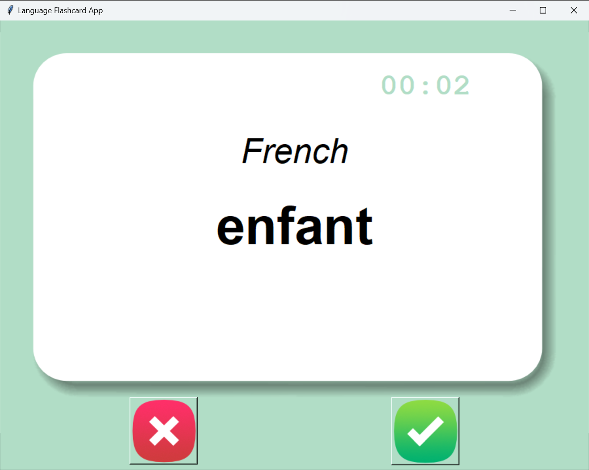

# Language Flashcard App

This is a simple flashcard app built with Python and Tkinter to help users learn French vocabulary. 
The app displays a French word and, after a short delay, flips the card to show its English translation. 
Users can mark words as known or unknown, and the app will continue to show only the unknown words.

## Features

- Randomly displays a French word using flashcards.
- Countdown timer before the answer is revealed
- Automatically flips to show the English meaning after 5 seconds.
- Buttons to mark if the word is known or not.
- Remembers your progress across sessions by saving unknown words to a CSV file. 
- Shows a "Well done" message when all words have been learned.
- Disables interaction once learning is complete

## Screenshot



## How to Run

1. Make sure you have Python installed.
2. Run the script:
```bash
python main.py
```

## Requirements

- Python 3.x
- pandas

Install pandas with:
```bash
pip install pandas
```

## Upcoming Updates

- Countdown timer on flashcards.
- Persistent saving of known words in a CSV file.

---

Built for language learners to practice vocabulary in an interactive way.